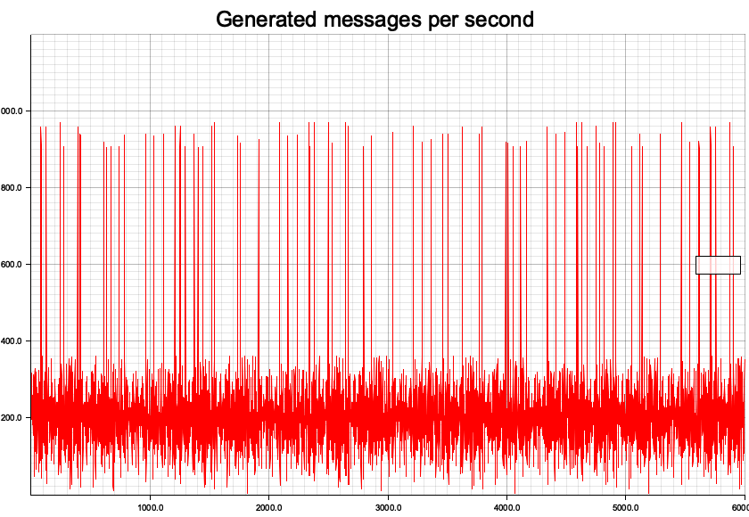

# Fast event production to test Kafka-compatible APIs
This is used to test services only.

## What it does
It will producer a sustained stream of messages as configured in `config.yaml`. The number of messages per seconds follows a simplex noise signals to better model real life scenarios in event-driven system.

For example, the default config will generate this "signal":


## Run

### As a Docker container
Build the image using the provided Dockerfile.

Run with mounted config file and exposed port 8081:
```
docker run -p 8081:8081 -v config.yaml:config.yaml --name event-producer -d event-producer:latest
```

### How to build
Requirements:

```
sudo apt install pkg-config build-essential libssl-dev libsasl2-dev
```

Then, using `cargo`:
```
cargo run --release --features kafka
```

Configs are to be modified in `config.yml` file, or loading another one and passing its name using the env var `MSG_PRODUCER_CONFIG_FILE`

### Metrics
Some basic Prometheus metrics are available at `127.0.0.1:8081/metrics` when running.
